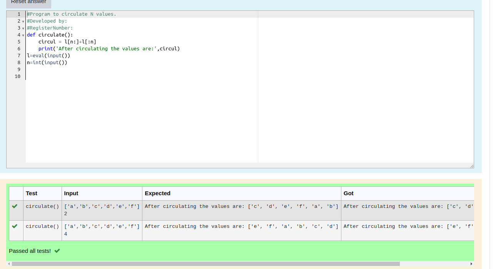

# Circulate-the-values-of-N-variables
## Aim:
To write a python program to circulate the n variables using function concept
## Equipment’s required:
PC
Anaconda - Python 3.7
## Algorithm: 
### Step 1: Program to circulate N values.
### Step 2: circulate the values
### Step 3: after circulating
Get the value from the user for the number of rotation
### Step 4: we get the values
Using the slicing concept rotate the list

### Step 5: 
### Step 6: print the result
## Program:
#Program to circulate N values.
#Developed by: kavya.k
#RegisterNumber:22008613
```python
def circulate():
    circul = l[n:]+l[:n]
    print('After circulating the values are:',circul)
l=eval(input())
n=int(input())
```python

## Output:

## Result:
The circulating values are successfully found by python programing
